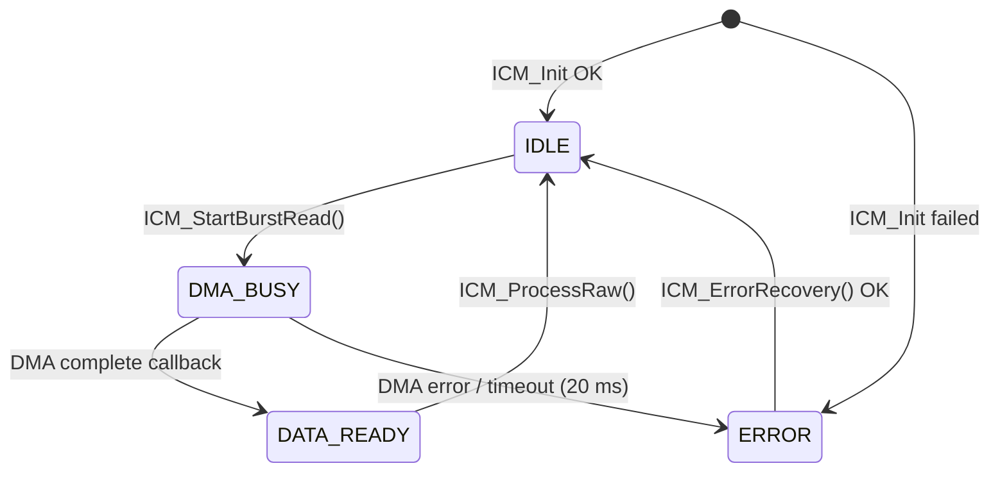

# ICM-20948 Library (STM32 HAL, I2C + DMA)

A small, dependency-free C driver for the **TDK InvenSense ICM-20948** 9-axis IMU
(accelerometer, gyroscope, AK09916 magnetometer, temperature) on **STM32** using the
HAL I2C peripheral with **non-blocking DMA reads**.

- One 23-byte burst read per sample: accel + gyro + temperature + magnetometer
- Non-blocking acquisition driven by a simple state machine (`IDLE → DMA_BUSY → DATA_READY`)
- Magnetometer is read through the ICM-20948's internal I2C master, so the STM32 only talks to one device
- Fault flags, DMA timeout detection and automatic error recovery (bus re-init + reconfigure)
- Bias calibration for gyro (static) and magnetometer (min/max hard-iron)
- Fixed-size buffers, no dynamic allocation, bounded loops, explicit `U`/`F` literal suffixes (MISRA-C style)

> Status: working, tested on one board. See [Known limitations](#known-limitations).

## Tested setup

| Item | Value |
|------|-------|
| MCU | STM32F407 (SYSCLK 168 MHz, APB1 42 MHz) |
| Bus | I2C1 on PB6 (SCL) / PB7 (SDA), 400 kHz fast mode, duty 2 |
| DMA | DMA1 Stream0 → I2C1_RX |
| Sensor address | `0x68` (AD0 → GND) or `0x69` (AD0 → 3V3); pass it **shifted left by 1** to HAL |
| Optional pin | PA0 configured as EXTI (data-ready INT) — currently **unused**, polling is used instead |
| Toolchain | STM32CubeIDE + STM32Cube HAL |

## Repository layout

```
.
├── ICM_20948_DMA_I2C.h    # Public API, handle structs, enums, scale constants
├── ICM_20948_I2C.h        # Register map and bit definitions
├── ICM_20948_I2C.c        # Driver implementation
├── examples/
│   └── main_example.c     # Application code to paste into a CubeMX-generated main.c
├── docs/
│   └── ARCHITECTURE.md    # Design notes: data flow, state machine, register setup
└── tools/
    ├── icm_logger.py          # Log the UART stream to CSV (+ metadata JSON)
    ├── icm_live_plot.py       # Real-time accel/gyro plot with lost-line detection
    ├── icm_data_quality.py    # Allan deviation, accel/gyro delay, gravity check
    ├── requirements.txt       # numpy, matplotlib, pyserial
    └── .gitignore             # keeps recorded logs (*.csv, *.meta.json) out of Git
```

Copy the three driver files into your project (`Core/Inc` and `Core/Src` in CubeIDE).

## CubeMX configuration checklist

1. **I2C1**: Fast mode 400 kHz. Add a DMA request `I2C1_RX` (Peripheral → Memory, Normal mode, byte width, memory increment on).
2. **NVIC**: enable `DMA1 stream0`, `I2C1 event` and `I2C1 error` interrupts.
3. External pull-ups on SDA/SCL (typically 2.2–4.7 kΩ) unless your breakout board already has them.
4. Optional: a UART (the example uses USART2 at 460800 baud) for streaming samples to a PC.

## Quick start

```c
#include "ICM_20948_DMA_I2C.h"

static ICM_Handle_t icm;
static const ICM_HW_t icm_hw =
{
    .hi2c        = &hi2c1,
    .i2c_address = (uint16_t)(0x68U << 1U)   /* AD0 -> GND */
};

int main(void)
{
    /* HAL_Init(), clocks, MX_..._Init() generated by CubeMX */

    if (ICM_Init(&icm, &icm_hw) != HAL_OK)
    {
        Error_Handler();
    }

    ICM_CalibrateGyro(&icm, 200U);              /* keep the sensor still (~4 s) */
    if (icm.status.mag_available)
    {
        ICM_CalibrateMag(&icm, 500U);           /* rotate through all orientations (~5 s) */
    }

    uint32_t last_start = HAL_GetTick();

    while (1)
    {
        ICM_CheckTimeout(&icm);

        if (icm.status.state == ICM_STATE_ERROR)
        {
            ICM_ErrorRecovery(&icm);
        }

        if (icm.status.state == ICM_STATE_DATA_READY)
        {
            ICM_ProcessRaw(&icm);
            /* icm.data.accel_g[], gyro_dps[], mag_ut[], temp_c are now valid */
        }

        if ((HAL_GetTick() - last_start) >= 4U)
        {
            last_start = HAL_GetTick();
            (void)ICM_StartBurstRead(&icm);     /* returns HAL_BUSY if a read is in flight */
        }
    }
}

/* Forward HAL callbacks to the driver (put in USER CODE 4) */
void HAL_I2C_MemRxCpltCallback(I2C_HandleTypeDef *hi2c)
{
    if (hi2c->Instance == I2C1) { ICM_DMA_Callback(&icm); }
}

void HAL_I2C_ErrorCallback(I2C_HandleTypeDef *hi2c)
{
    if (hi2c->Instance == I2C1) { ICM_DMA_ErrorCallback(&icm); }
}
```

A fuller example (complementary filter for roll/pitch, UART CSV streaming) is in
[`examples/main_example.c`](examples/main_example.c).

## How it works (short version)



1. `ICM_StartBurstRead()` starts a DMA read of 23 bytes beginning at `ACCEL_XOUT_H` and returns immediately.
2. When the transfer finishes, the HAL callback calls `ICM_DMA_Callback()`, which copies the buffer and sets `DATA_READY`.
3. The main loop calls `ICM_ProcessRaw()`, which converts raw counts to physical units and returns the driver to `IDLE`.

More detail (packet layout, register setup, recovery logic) is in [`docs/ARCHITECTURE.md`](docs/ARCHITECTURE.md).

## API

| Function | Blocking? | Purpose |
|----------|-----------|---------|
| `ICM_Init(h, hw)` | Yes | Reset the handle, verify `WHO_AM_I`, configure sensors and magnetometer |
| `ICM_StartBurstRead(h)` | No | Start a 23-byte DMA read; `HAL_BUSY` if not `IDLE` |
| `ICM_DMA_Callback(h)` | — | Call from `HAL_I2C_MemRxCpltCallback` (ISR context) |
| `ICM_DMA_ErrorCallback(h)` | — | Call from `HAL_I2C_ErrorCallback` (ISR context) |
| `ICM_ProcessRaw(h)` | No (CPU only) | Convert raw packet to `accel_g`, `gyro_dps`, `mag_ut`, `temp_c` |
| `ICM_CheckTimeout(h)` | No | Flag an error if a DMA read exceeds 20 ms |
| `ICM_ErrorRecovery(h)` | Yes | Re-init I2C, reconfigure the IMU (max 3 attempts) |
| `ICM_CalibrateGyro(h, n)` | Yes | Average `n` samples (20 ms apart) as gyro bias; sensor must be still |
| `ICM_CalibrateMag(h, n)` | Yes | Track min/max over `n` samples (10 ms apart); bias = midpoint |
| `ICM_ReadReg` / `ICM_WriteReg` | Yes | Bank-aware single register access; `HAL_BUSY` while a DMA read is active |

Blocking functions must not be called while a DMA read is in progress and must not be called from an ISR.

## Default configuration

| Setting | Value | Where |
|---------|-------|-------|
| Sample-rate divider | 21 → accel ≈ 51.1 Hz, gyro ≈ 50 Hz | `ICM_ConfigureSensors()` |
| Accelerometer range | ±8 g (4096 LSB/g) | `ICM_ConfigureSensors()`, `ICM_ProcessAccel()` |
| Gyroscope range | ±500 dps (65.5 LSB/dps) | `ICM_ConfigureSensors()`, `ICM_ProcessGyro()` |
| Digital low-pass filter | ≈ 6 Hz (accel and gyro) | `ICM_ConfigureSensors()` |
| Magnetometer | AK09916, continuous 100 Hz, 0.15 µT/LSB | `ICM_ConfigureMagnetometer()` |
| I2C timeout (blocking calls) | 20 ms | `ICM_I2C_TIMEOUT_MS` |
| DMA timeout | 20 ms | `ICM_DMA_TIMEOUT_MS` |

If you change a full-scale range, update **both** the configuration register write and the scale factor used in the
`ICM_Process*` function (see [Known limitations](#known-limitations)).

## Output data

| Field | Unit | Notes |
|-------|------|-------|
| `data.accel_g[3]` | g | Sensor frame X, Y, Z; bias subtracted (`calib.accel_bias`, zero unless you set it) |
| `data.gyro_dps[3]` | °/s | Sensor frame; bias subtracted after `ICM_CalibrateGyro()` |
| `data.mag_ut[3]` | µT | AK09916 frame; hard-iron bias subtracted after `ICM_CalibrateMag()` |
| `data.temp_c` | °C | `raw / 333.87 + 21` |

## Fault flags

`status.fault_flags` is a sticky bitmask (`ICM_Fault_t`). Bits marked *transient* are cleared after a successful recovery.

| Flag | Meaning | Transient |
|------|---------|-----------|
| `ICM_FAULT_TRANSFER` | An I2C transfer failed | yes |
| `ICM_FAULT_WHO_AM_I` | Wrong or unreadable device ID (check wiring/address) | no |
| `ICM_FAULT_BANK_SELECT` | Register bank switch failed | yes |
| `ICM_FAULT_DMA` | DMA transfer error | yes |
| `ICM_FAULT_DMA_TIMEOUT` | DMA read did not finish within 20 ms | yes |
| `ICM_FAULT_MAG_NACK` | Magnetometer NACKed during configuration | yes |
| `ICM_FAULT_MAG_NO_RESPONSE` | Magnetometer absent, wrong ID, or data-ready never set (50 skips) | no |
| `ICM_FAULT_MAG_OVERFLOW` | Magnetic sensor overflow ≥ 10 consecutive samples | no |
| `ICM_FAULT_ACCEL_SATURATED` / `GYRO_SATURATED` | A raw axis reached ±32512 counts | no |
| `ICM_FAULT_GYRO_BIAS` / `MAG_BIAS` | Calibration failed or gyro bias is implausibly large | no |
| `ICM_FAULT_RECOVERY_LIMIT` | Recovery attempted more than 3 times | no |

The magnetometer is **best effort**: if it fails to configure, `status.mag_available` is `false` and accel/gyro keep working.

## Host-side tools (Python)

The `tools/` folder has PC-side scripts for inspecting the data the firmware streams over UART. They answer one
question: *is this IMU data clean enough to feed a fusion filter* (complementary / Mahony / EKF / ESKF)?

| Script | Purpose |
|--------|---------|
| `icm_live_plot.py` | Real-time plot of accel and gyro (two subplots); detects lost lines from the sequence number |
| `icm_logger.py` | Records the stream to CSV (plus a metadata file) with no plotting, so a GUI cannot add jitter to the serial read |
| `icm_data_quality.py` | Offline analysis of a log: Allan deviation, accel↔gyro relative delay, gravity-magnitude check |

```bash
pip install -r tools/requirements.txt     # numpy, matplotlib, pyserial
```

On Linux the user must be in the `dialout` group to open `/dev/ttyUSB*` (`sudo usermod -aG dialout $USER`, then log out and in).
Log files (`*.csv`, `*.meta.json`) are ignored by `tools/.gitignore`.

### UART stream format

With `ICM_UART_STREAM_ENABLE` defined, `examples/main_example.c` sends one CSV line per processed read at 460800 baud, 8N1:

```
timestamp_ms,seq,ax,ay,az,gx,gy,gz\r\n
```

| Field | Unit | Meaning |
|-------|------|---------|
| `timestamp_ms` | ms | `HAL_GetTick()` when the line is sent |
| `seq` | – | Counter of processed reads (`g_sample_count`); a gap means lines were lost |
| `ax, ay, az` | g | Accelerometer |
| `gx, gy, gz` | °/s | Gyroscope |

`seq` counts **reads**, not unique sensor samples: the example polls every 4 ms while the sensor outputs about 51 Hz,
so each sample appears in several consecutive rows. The analysis script handles this (see below).

### Live plot

```bash
python3 tools/icm_live_plot.py /dev/ttyUSB0 460800
python3 tools/icm_live_plot.py /dev/ttyUSB0 460800 --window 600     # keep 600 rows on screen
```

| Option | Default | Meaning |
|--------|---------|---------|
| `--window N` | 300 | Number of rows kept on the time axis |
| `--cols {6,7,8}` | 8 | 8 = `timestamp_ms,seq,…`; 7 = `seq,…` (older firmware); 6 = no `seq` (loss detection disabled) |

- The X axis is the **firmware timestamp**, so a gap in the data appears as a gap of the right width.
  With `--cols 7` or `6` it falls back to the PC receive time, which is bunched because lines arrive in bursts.
- A missing sequence number, or a firmware restart (`seq` or `timestamp_ms` going backwards), breaks the trace.
- The title shows lost lines (from `seq` gaps), malformed lines and detected restarts.
- Serial reading runs in a background thread, so a partial line cannot freeze the window.

### Logger

```bash
python3 tools/icm_logger.py /dev/ttyUSB0 460800 --warmup 60 --duration 600 --out static.csv \
    --odr-hz 51 --dlpf-accel-hz 6 --dlpf-gyro-hz 6
```

| Option | Meaning |
|--------|---------|
| `--duration S` | Recording time in seconds (default 60) |
| `--warmup S` | Seconds to discard first so the sensor can warm up (default 0) |
| `--out FILE` | Output CSV (default `icm_log.csv`) |
| `--odr-hz`, `--dlpf-accel-hz`, `--dlpf-gyro-hz`, `--accel-fs-g`, `--gyro-fs-dps`, `--note` | Sensor settings and a free-text note, stored in the metadata file |

Two files are written:

- `static.csv` with columns `rx_time_s,timestamp_ms,seq,ax_g,ay_g,az_g,gx_dps,gy_dps,gz_dps`.
  `rx_time_s` is the PC receive time, for debugging only (it jitters with the OS and USB stack).
- `static.meta.json` with the settings you passed and the counters of the run (rows, lost, malformed, restarts).
  `icm_data_quality.py` reads it automatically, so the configuration travels with the data.

The script prints the number of rows, lost lines (`seq` gaps; a corrupted line counts as malformed and as lost) and
firmware restarts, and warns if more than 1 % of the lines were lost.

### Data-quality analysis

1. **Static log**: keep the IMU completely still on a rigid surface, after a warm-up (`--warmup`).
2. **Motion log** (optional, for the delay estimate): tilt slowly and smoothly about the X axis by 10–30° at about 1 Hz for about 20 s.
3. Run the analysis:

```bash
python3 tools/icm_logger.py /dev/ttyUSB0 460800 --warmup 60 --duration 600 --out static.csv \
    --odr-hz 51 --dlpf-accel-hz 6 --dlpf-gyro-hz 6
python3 tools/icm_logger.py /dev/ttyUSB0 460800 --duration 20 --out motion.csv
python3 tools/icm_data_quality.py --static static.csv --motion motion.csv
```

| Option | Meaning |
|--------|---------|
| `--static FILE` | Static log (required) |
| `--motion FILE` | Motion log; enables the cross-correlation delay estimate |
| `--odr-hz F` | Nominal sensor output rate [Hz], used as a cross-check (default: from the metadata file) |
| `--dt-source {measured,nominal}` | Time base: measured from the firmware timestamps (default) or `1/--odr-hz` |
| `--dlpf-accel-hz F`, `--dlpf-gyro-hz F` | DLPF cut-offs for the analytic delay (default: from the metadata file) |
| `--external-accel-threshold-g F` | Deviation of ‖a‖ from its median flagged as external acceleration (default 0.05) |
| `--overlapping` | Use the overlapping Allan estimator instead of non-overlapping clusters |
| `--no-dedupe` | Do not collapse repeated rows (use when the log has one row per sensor sample) |
| `--save-prefix P` | Save the figures as `P_allan.png`, `P_gravity.png`, `P_delay.png` |
| `--no-show` | Do not open plot windows (headless use) |

**How the log is prepared**

- **Repeated rows are collapsed.** Consecutive rows with identical values are one sensor sample read several times.
  Treating them as independent samples would scale the τ axis and the delay by the repeat factor. The report shows how
  often each sample was read.
- **The sample period is measured** from the firmware timestamps over the longest gap-free segment. The ICM-20948 uses an
  on-chip oscillator, so its configured ODR is only nominal; the script warns if the two differ by more than 3 %.
- **The log is split at gaps** (lost samples, firmware restarts). The Allan analysis uses the longest segment, and the
  report shows how much of the log it covers.

**What it reports**

- **Allan deviation** of every gyro and accel axis, by default with the non-overlapping cluster method. For each
  averaging time τ the data are split into clusters of `m = τ / dt` samples, and
  $\sigma^2(\tau) = \tfrac{1}{2}\left\langle(\bar y_{k+1}-\bar y_k)^2\right\rangle$ where $\bar y_k$ is the mean of cluster *k*.
  The plot shades an approximate ±1σ confidence band, which widens at large τ where few clusters remain.
- **Noise figures** read from the curve (table below):
  - *Bias instability* = ADEV minimum / 0.664 (IEEE 952). It is reported only if the minimum is really observed; if the
    curve is still falling at the longest τ, the script says so instead of reporting a number.
  - *ARW / VRW* = ADEV at τ = 1 s, valid when the local slope is about −½ (the script checks it). Converted to
    °/√hr (gyro, × 60) and (m/s)/√hr (accel, × 60 × 9.80665).
- **Gravity check**: while still, ‖a‖ should be constant. Samples that deviate from the median are marked as external
  acceleration, and a median far from 1 g indicates an accelerometer scale/bias error.
- **Relative delay** between the accel-derived and the gyro-integrated tilt angle, by cross-correlation (positive = accel lags gyro).
  The static gyro-X bias is removed, both angles are detrended, and the correlation peak is refined by a parabola, so the
  result is not limited to whole samples. The correlation peak value is reported as a quality indicator.
- **Analytic group delay** of the DLPF, `1 / (2π·fc)`: a one-pole approximation and only a lower bound, because the real DLPF is higher order.
- A qualitative summary (gyro grade, bias instability, ARW/VRW, delay class). It is a reference, not a pass/fail test.

| Region of the log-log plot | Slope | Meaning |
|----------------------------|-------|---------|
| Short τ | −½ | White noise: angle/velocity random walk (ARW / VRW). Read as σ(τ ≈ 1 s) |
| Flat minimum | 0 | Bias instability |
| Long τ | +½ | Rate random walk (slow drift) |

### Notes and limitations of the tools

- **Log length.** A few minutes are enough for the white-noise region. Seeing the bias-instability minimum of a MEMS gyro
  typically needs a much longer log (tens of minutes) after warm-up; with a short log the script reports "not observed".
  Temperature drift is not separated from bias instability.
- **Repeated-row detection** compares the printed values (accel `%.4f`, gyro `%.3f`). Two genuinely different consecutive
  samples that print identically on all six channels would be merged; this is very unlikely with real sensor noise.
- **One segment is analysed.** If the log has many gaps, the longest gap-free part may be short; re-record instead.
- **Delay estimate.** It needs real tilting about the X axis, measures only the *difference* between the accel and gyro
  paths, and its 5 ms / 20 ms classes are heuristic. Always pass or record the settings you actually configured
  (the driver default is about 51 Hz output rate with a 6 Hz DLPF).
- To remove the repeated reads at the source instead, read once per data-ready event (INT pin) rather than polling.

## Known limitations

- Calibration functions are **blocking** (about 4 s for gyro with 200 samples, about 5 s for mag with 500 samples).
- Magnetometer calibration is hard-iron only (min/max midpoint); there is no soft-iron correction, and the AK09916 axes are
  not remapped to the accel/gyro frame (check the datasheet before fusing them).
- The example polls every 4 ms while the sensor output rate is ~51 Hz, so the same sample can be read several times.
  Do not treat `g_sample_count` as a count of unique samples. The
  [Python analysis tools](#host-side-tools-python) collapse the repeated rows automatically.
- Full-scale ranges are configured in one place and converted in another; keep them in sync.
- No FIFO, DMP, SPI or interrupt-driven (INT pin) acquisition yet.

## License

Released under the MIT License. See [LICENSE](LICENSE).