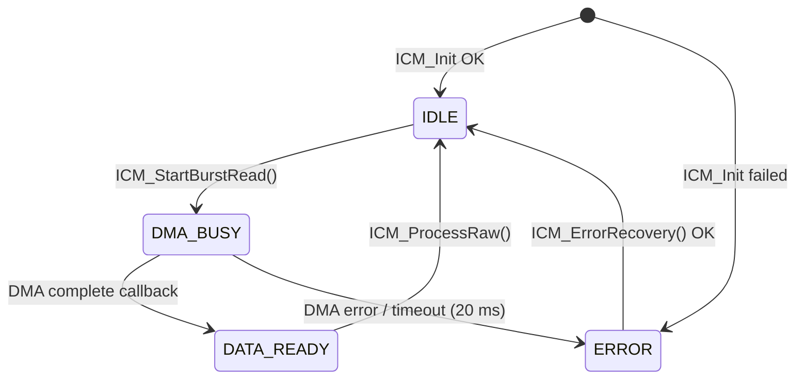

# ICM-20948 Library (STM32 HAL, I2C + DMA)

A small, dependency-free C driver for the **TDK InvenSense ICM-20948** 9-axis IMU
(accelerometer, gyroscope, AK09916 magnetometer, temperature) on **STM32** using the
HAL I2C peripheral with **non-blocking DMA reads**.

- One 23-byte burst read per sample: accel + gyro + temperature + magnetometer
- Non-blocking acquisition driven by a simple state machine (`IDLE → DMA_BUSY → DATA_READY`)
- Magnetometer is read through the ICM-20948's internal I2C master, so the STM32 only talks to one device
- Fault flags, DMA timeout detection and automatic error recovery (bus re-init + reconfigure)
- Bias calibration for gyro (static) and magnetometer (min/max hard-iron)
- Fixed-size buffers, no dynamic allocation, bounded loops, explicit `U`/`F` literal suffixes (MISRA-C style)

> Status: working, tested on one board. See [Known limitations](#known-limitations).

## Tested setup

| Item | Value |
|------|-------|
| MCU | STM32F407 (SYSCLK 168 MHz, APB1 42 MHz) |
| Bus | I2C1 on PB6 (SCL) / PB7 (SDA), 400 kHz fast mode, duty 2 |
| DMA | DMA1 Stream0 → I2C1_RX |
| Sensor address | `0x68` (AD0 → GND) or `0x69` (AD0 → 3V3); pass it **shifted left by 1** to HAL |
| Optional pin | PA0 configured as EXTI (data-ready INT) — currently **unused**, polling is used instead |
| Toolchain | STM32CubeIDE + STM32Cube HAL |

## Repository layout

```
.
├── ICM_20948_DMA_I2C.h    # Public API, handle structs, enums, scale constants
├── ICM_20948_I2C.h        # Register map and bit definitions
├── ICM_20948_I2C.c        # Driver implementation
├── examples/
│   └── main_example.c     # Application code to paste into a CubeMX-generated main.c
└── docs/
    └── ARCHITECTURE.md    # Design notes: data flow, state machine, register setup
```

Copy the three driver files into your project (`Core/Inc` and `Core/Src` in CubeIDE).

## CubeMX configuration checklist

1. **I2C1**: Fast mode 400 kHz. Add a DMA request `I2C1_RX` (Peripheral → Memory, Normal mode, byte width, memory increment on).
2. **NVIC**: enable `DMA1 stream0`, `I2C1 event` and `I2C1 error` interrupts.
3. External pull-ups on SDA/SCL (typically 2.2–4.7 kΩ) unless your breakout board already has them.
4. Optional: a UART (the example uses USART2 at 460800 baud) for streaming samples to a PC.

## Quick start

```c
#include "ICM_20948_DMA_I2C.h"

static ICM_Handle_t icm;
static const ICM_HW_t icm_hw =
{
    .hi2c        = &hi2c1,
    .i2c_address = (uint16_t)(0x68U << 1U)   /* AD0 -> GND */
};

int main(void)
{
    /* HAL_Init(), clocks, MX_..._Init() generated by CubeMX */

    if (ICM_Init(&icm, &icm_hw) != HAL_OK)
    {
        Error_Handler();
    }

    ICM_CalibrateGyro(&icm, 200U);              /* keep the sensor still (~4 s) */
    if (icm.status.mag_available)
    {
        ICM_CalibrateMag(&icm, 500U);           /* rotate through all orientations (~5 s) */
    }

    uint32_t last_start = HAL_GetTick();

    while (1)
    {
        ICM_CheckTimeout(&icm);

        if (icm.status.state == ICM_STATE_ERROR)
        {
            ICM_ErrorRecovery(&icm);
        }

        if (icm.status.state == ICM_STATE_DATA_READY)
        {
            ICM_ProcessRaw(&icm);
            /* icm.data.accel_g[], gyro_dps[], mag_ut[], temp_c are now valid */
        }

        if ((HAL_GetTick() - last_start) >= 4U)
        {
            last_start = HAL_GetTick();
            (void)ICM_StartBurstRead(&icm);     /* returns HAL_BUSY if a read is in flight */
        }
    }
}

/* Forward HAL callbacks to the driver (put in USER CODE 4) */
void HAL_I2C_MemRxCpltCallback(I2C_HandleTypeDef *hi2c)
{
    if (hi2c->Instance == I2C1) { ICM_DMA_Callback(&icm); }
}

void HAL_I2C_ErrorCallback(I2C_HandleTypeDef *hi2c)
{
    if (hi2c->Instance == I2C1) { ICM_DMA_ErrorCallback(&icm); }
}
```

A fuller example (complementary filter for roll/pitch, UART CSV streaming) is in
[`examples/main_example.c`](examples/main_example.c).

## How it works (short version)



1. `ICM_StartBurstRead()` starts a DMA read of 23 bytes beginning at `ACCEL_XOUT_H` and returns immediately.
2. When the transfer finishes, the HAL callback calls `ICM_DMA_Callback()`, which copies the buffer and sets `DATA_READY`.
3. The main loop calls `ICM_ProcessRaw()`, which converts raw counts to physical units and returns the driver to `IDLE`.

More detail (packet layout, register setup, recovery logic) is in [`docs/ARCHITECTURE.md`](docs/ARCHITECTURE.md).

## API

| Function | Blocking? | Purpose |
|----------|-----------|---------|
| `ICM_Init(h, hw)` | Yes | Reset the handle, verify `WHO_AM_I`, configure sensors and magnetometer |
| `ICM_StartBurstRead(h)` | No | Start a 23-byte DMA read; `HAL_BUSY` if not `IDLE` |
| `ICM_DMA_Callback(h)` | — | Call from `HAL_I2C_MemRxCpltCallback` (ISR context) |
| `ICM_DMA_ErrorCallback(h)` | — | Call from `HAL_I2C_ErrorCallback` (ISR context) |
| `ICM_ProcessRaw(h)` | No (CPU only) | Convert raw packet to `accel_g`, `gyro_dps`, `mag_ut`, `temp_c` |
| `ICM_CheckTimeout(h)` | No | Flag an error if a DMA read exceeds 20 ms |
| `ICM_ErrorRecovery(h)` | Yes | Re-init I2C, reconfigure the IMU (max 3 attempts) |
| `ICM_CalibrateGyro(h, n)` | Yes | Average `n` samples (20 ms apart) as gyro bias; sensor must be still |
| `ICM_CalibrateMag(h, n)` | Yes | Track min/max over `n` samples (10 ms apart); bias = midpoint |
| `ICM_ReadReg` / `ICM_WriteReg` | Yes | Bank-aware single register access; `HAL_BUSY` while a DMA read is active |

Blocking functions must not be called while a DMA read is in progress and must not be called from an ISR.

## Default configuration

| Setting | Value | Where |
|---------|-------|-------|
| Sample-rate divider | 21 → accel ≈ 51.1 Hz, gyro ≈ 50 Hz | `ICM_ConfigureSensors()` |
| Accelerometer range | ±8 g (4096 LSB/g) | `ICM_ConfigureSensors()`, `ICM_ProcessAccel()` |
| Gyroscope range | ±500 dps (65.5 LSB/dps) | `ICM_ConfigureSensors()`, `ICM_ProcessGyro()` |
| Digital low-pass filter | ≈ 6 Hz (accel and gyro) | `ICM_ConfigureSensors()` |
| Magnetometer | AK09916, continuous 100 Hz, 0.15 µT/LSB | `ICM_ConfigureMagnetometer()` |
| I2C timeout (blocking calls) | 20 ms | `ICM_I2C_TIMEOUT_MS` |
| DMA timeout | 20 ms | `ICM_DMA_TIMEOUT_MS` |

If you change a full-scale range, update **both** the configuration register write and the scale factor used in the
`ICM_Process*` function (see [Known limitations](#known-limitations)).

## Output data

| Field | Unit | Notes |
|-------|------|-------|
| `data.accel_g[3]` | g | Sensor frame X, Y, Z; bias subtracted (`calib.accel_bias`, zero unless you set it) |
| `data.gyro_dps[3]` | °/s | Sensor frame; bias subtracted after `ICM_CalibrateGyro()` |
| `data.mag_ut[3]` | µT | AK09916 frame; hard-iron bias subtracted after `ICM_CalibrateMag()` |
| `data.temp_c` | °C | `raw / 333.87 + 21` |

## Fault flags

`status.fault_flags` is a sticky bitmask (`ICM_Fault_t`). Bits marked *transient* are cleared after a successful recovery.

| Flag | Meaning | Transient |
|------|---------|-----------|
| `ICM_FAULT_TRANSFER` | An I2C transfer failed | yes |
| `ICM_FAULT_WHO_AM_I` | Wrong or unreadable device ID (check wiring/address) | no |
| `ICM_FAULT_BANK_SELECT` | Register bank switch failed | yes |
| `ICM_FAULT_DMA` | DMA transfer error | yes |
| `ICM_FAULT_DMA_TIMEOUT` | DMA read did not finish within 20 ms | yes |
| `ICM_FAULT_MAG_NACK` | Magnetometer NACKed during configuration | yes |
| `ICM_FAULT_MAG_NO_RESPONSE` | Magnetometer absent, wrong ID, or data-ready never set (50 skips) | no |
| `ICM_FAULT_MAG_OVERFLOW` | Magnetic sensor overflow ≥ 10 consecutive samples | no |
| `ICM_FAULT_ACCEL_SATURATED` / `GYRO_SATURATED` | A raw axis reached ±32512 counts | no |
| `ICM_FAULT_GYRO_BIAS` / `MAG_BIAS` | Calibration failed or gyro bias is implausibly large | no |
| `ICM_FAULT_RECOVERY_LIMIT` | Recovery attempted more than 3 times | no |

The magnetometer is **best effort**: if it fails to configure, `status.mag_available` is `false` and accel/gyro keep working.

## Known limitations

- Calibration functions are **blocking** (about 4 s for gyro with 200 samples, about 5 s for mag with 500 samples).
- Magnetometer calibration is hard-iron only (min/max midpoint); there is no soft-iron correction, and the AK09916 axes are
  not remapped to the accel/gyro frame (check the datasheet before fusing them).
- The example polls every 4 ms while the sensor output rate is ~51 Hz, so the same sample can be read several times.
  Do not treat `g_sample_count` as a count of unique samples.
- Full-scale ranges are configured in one place and converted in another; keep them in sync.
- No FIFO, DMP, SPI or interrupt-driven (INT pin) acquisition yet.

## License
Released under the MIT License. See LICENSE.